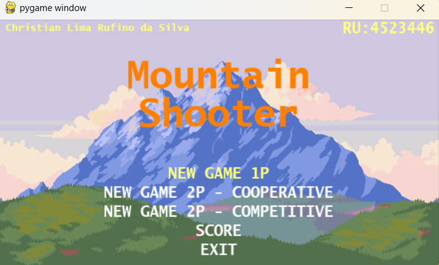

### About

Mountain Shooter é um jogo de arcade 2D desenvolvido com Pygame. O jogo tem 3 níveis e cada nível termina com um evento de tempo limite.
Pode ser jogado em modo cooperativo (2 jogadores).
A pontuação é salva no banco de dados (SQLite3))

Obs: Atuado por mim(Aluno - Christian Rufino) apenas no nível 3.
### Feel free if you want to contribute.

GAME MENU

 

  

GAME LEVEL 3

 

  

